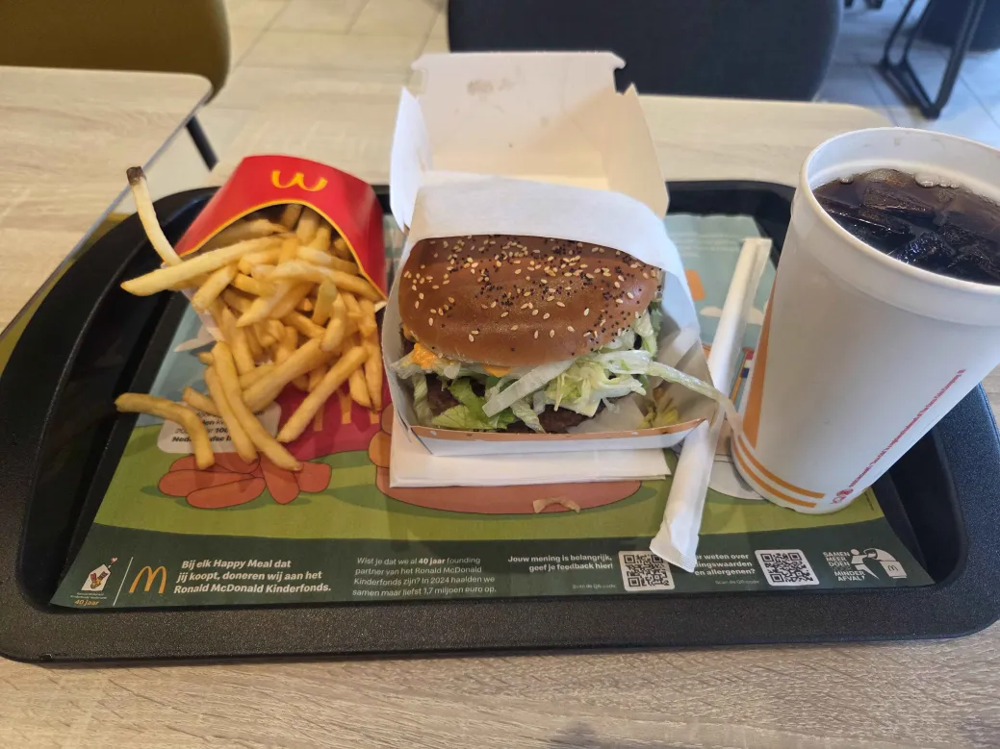

# skill-github-les4-c

## kleiner kop
### weer kleiner
**BELANGERIJK**
*dit is ook belangerijk*

***ook belangerijk***
------
[jij gaat dit nooit klikken, zeker](https://youtu.be/dQw4w9WgXcQ?si=OAVIpSKN4JFe9Td0)


<40689@ma-web.nl>

* 1
* 2
* 3
* 4
* 5

1. ik eet een burger
1.     het was lekker
------

``` dit is een codeblok ```